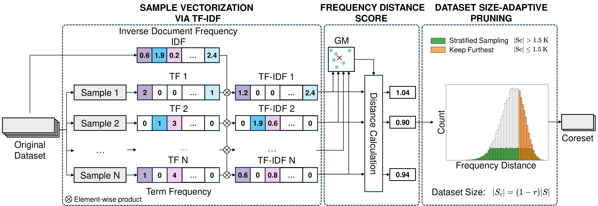

# Swift Cross-Dataset Pruning: Enhancing Fine-Tuning Efficiency in Natural Language Understanding [Official]
[[`Paper`](http://arxiv.org/abs/2501.02432) | [`BibTex`](#citation) | [`OneDrive`](https://1drv.ms/f/s!AskMbyFms6M2i8Fysa5tcPw3cviU3w?e=svcccb)]

---

Official Implementation for "Swift Cross-Dataset Pruning: Enhancing Fine-Tuning Efficiency in Natural Language Understanding", published at COLING 2025.

Authors: [Binh-Nguyen Nguyen](https://scholar.google.com/citations?user=B_515EsAAAAJ),&nbsp; [Yang He](https://scholar.google.com/citations?user=vvnFsIIAAAAJ)

CFAR, A*STAR Agency for Science, Technology and Research

> **Abstract**: Dataset pruning aims to select a subset of a dataset for efficient model training. While data efficiency in natural language processing has primarily focused on within-corpus scenarios during model pre-training, efficient dataset pruning for task-specific fine-tuning across diverse datasets remains challenging due to variability in dataset sizes, data distributions, class imbalance and label spaces. Current cross-dataset pruning techniques for fine-tuning often rely on computationally expensive sample ranking processes, typically requiring full dataset training or reference models. We address this gap by proposing ***Swift Cross-Dataset Pruning (SCDP)***. Specifically, our approach uses TF-IDF embeddings with geometric median to rapidly evaluate sample importance.  We then apply dataset size-adaptive pruning to ensure diversity: for smaller datasets, we retain samples far from the geometric median, while for larger ones, we employ distance-based stratified pruning. Experimental results on six diverse datasets demonstrate the effectiveness of our method, spanning various tasks and scales while significantly reducing computational resources.

<div align=left>

</div>

## Installation

Download repo:
```sh
git clone https://github.com/nguyenrtm/scdp-pruning.git scdp_pruning
cd scdp_pruning
```

Create conda environment:
```sh
conda env create -f environment.yml
conda activate scdp
```

## Dataset Pruning

### Swift Cross-Dataset Pruning (SCDP)
Please replace `{RATIO}` with the following ratios: `0.3`, `0.5`, `0.7`, `0.9`. This ratio is the ratio of the coreset after dataset pruning. Replace `{DATASET}` with one of the following datasets: `rte`, `mrpc`, `cola`, `sst2`, `swag`, `qnli`.
```shell
bash scripts/run_scdp.sh {DATASET} {RATIO} tfidf
```
Alternatively, to run SCDP on all datasets and all pruning rates reported in our paper, you can use the following command.
```shell
bash scripts/run_scdp_all.sh
```

### Random Dataset Pruning
Please replace `{RATIO}` with the following ratios: `0.3`, `0.5`, `0.7`, `0.9`. This ratio is the ratio of the coreset after dataset pruning. Replace `{DATASET}` with one of the following datasets: `rte`, `mrpc`, `cola`, `sst2`, `swag`, `qnli`.
```shell
bash scripts/run_random.sh {DATASET} {RATIO}
```

### Baselines
Please replace `{RATIO}` with the following ratios: `0.3`, `0.5`, `0.7`, `0.9`. This ratio is the ratio of the coreset after dataset pruning. Replace `{DATASET}` with one of the following datasets: `rte`, `mrpc`, `cola`, `sst2`, `swag`, `qnli`.
```shell
# EL2N
bash scripts/run_el2n.sh {DATASET} {RATIO}

# Forgetting
bash scripts/run_forgetting.sh {DATASET} {RATIO}

# AUM
bash scripts/run_aum.sh {DATASET} {RATIO}

# CCS
bash scripts/run_ccs.sh {DATASET} {RATIO}
```

Experiment logs can be accessed at `./logs`. Selected data samples from different pruning methods can be accessed at `./results/importance_sort`.

## Table Results ([OneDrive](https://1drv.ms/f/s!AskMbyFms6M2i8Fysa5tcPw3cviU3w?e=svcccb))

| No.                                                                     | Content                                                                                 |
| ------------------------------------------------------------------------| --------------------------------------------------------------------------------------- |
| Table 1                                                                 | Description of datasets                                                                 |
| [Table 2](https://1drv.ms/f/s!AskMbyFms6M2i8F3cSE2uIZOjxl3pw?e=SQ3ljw)  | SCDP vs Baselines                                                                       |
| [Table 3](https://1drv.ms/f/s!AskMbyFms6M2i8F252wHkldiF5cUMA?e=F08FNd)  | Ablation Study for Embeddings                                                           |
| [Table 4](https://1drv.ms/f/s!AskMbyFms6M2i8F1rMOhGRDdaoiyjQ?e=ABarGg)  | SCDP vs Random Selection                                                                |
| [Table 5](https://1drv.ms/f/s!AskMbyFms6M2i8F0eoOT2A2jCO0b7w?e=DftIBS)  | Comparison on other models                                                              |
| Table 6-7                                                               | Examples                                                                                |
| [Table 8](https://1drv.ms/f/s!AskMbyFms6M2i8FzNZ26GQ7Gg2Q4IQ?e=no07sn)  | Full result                                                                             |
| Table 9-14                                                              | Examples                                                                                |

## Citation

```
@inproceedings{nguyen2025swift,
  title={Swift Cross-Dataset Pruning: Enhancing Fine-Tuning Efficiency in Natural Language Understanding},
  author={Nguyen, Binh-Nguyen and He, Yang},
  booktitle={Proceedings of the 31st International Conference on Computational Linguistics},
  year={2025}
}
```
